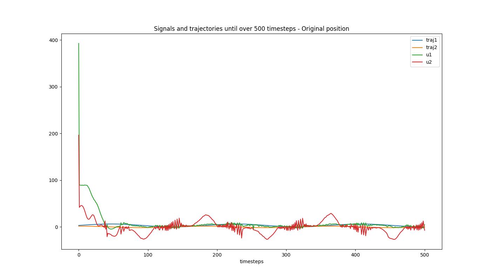
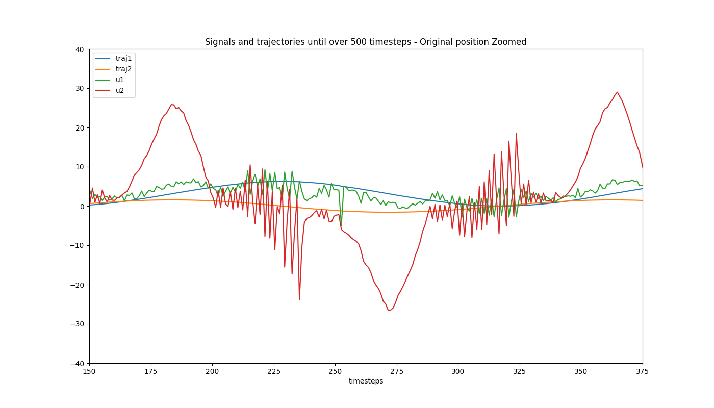
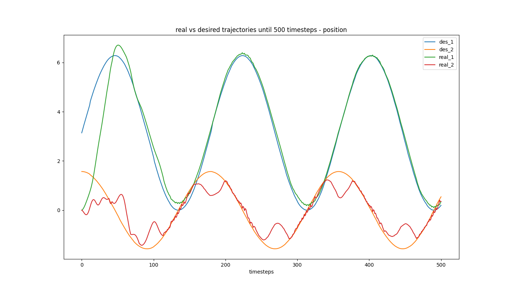
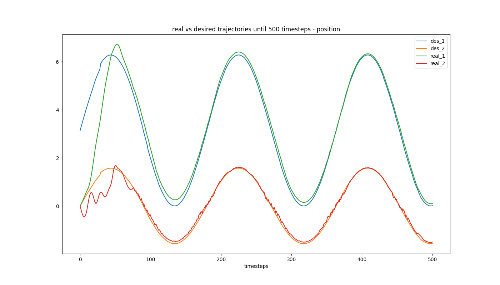
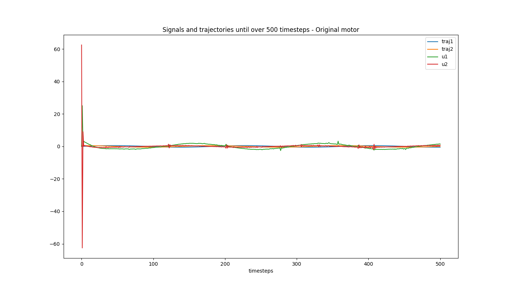
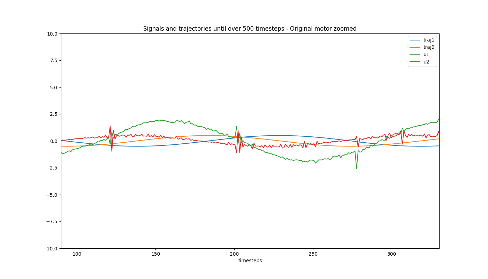
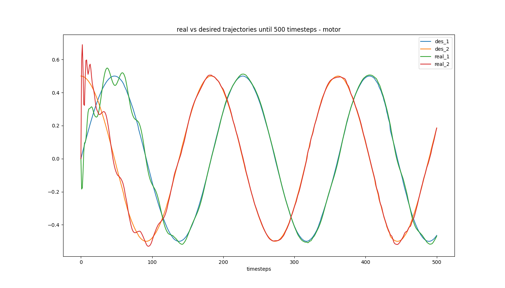

# Introduction to the MuJoCo Simulator Workshop - Edited

This repository is forked from the [Introduction to the MuJoCo Simulator Workshop](https://github.com/willcforte/Introduction-to-MuJoCo-Workshop) by [Will C. Forte](https://willcforte.com/) for a workshop held at the Rutgers N2E Robotics club.

This was made so I could learn and understand MuJoCo for my master's thesis. This includes experimenting with models and Python scripts to observe behavior changes and getting familiar with the MuJoCo workflow.

Please refer to the original branch for the original workshop contents. 

## Setup

Prerequisites: MuJoCo (Python API), numpy, matplotlib

The files modified are **only** in the `exercises` directory:
- Position
    - `og_postion_PID.py` - original PID gains with extra logging capability
    - `position_PID.py`
- Motor
    - `og_postion_PID.py` - original PID gains with extra logging capability
    - `position_PID.py`
    

Running: 
- The scripts will load the MuJoCo passive viewer GUI for simulation. After 500 simulation timesteps, graphs will generate and save to the `exercises/*PIDpics` folders. Simulations will continue running until user-terminated.
- Make sure to change the actuator scheme based on the script. e.g., if you are running `position_PID.py`, make sure the motor actuators in `2R_robotic_arm.xml` are commented out and position actuators are uncommented.

## Key Changes
- Gains
    - The original scripts uses a single set of gains for both joints. This can assume both joints have the same properties (inertia, friction, weight, etc.)
    - The new scripts uses arrays to specify different gains for each joint. These are also further tuned. 
- Logging
    - Original script tracks: target joint trajectories + control signals
    - New script tracks: target joint trajectories + actual joint positions

## Position

`og_postion_PID.py`
- j1: 3.14 sin... for desired trajectory
- j2 1.57 cos... for desired trajectory
- 1 set of PID gains for both 
    

`position_PID.py`

V1 (PIDforbothJ.png)
- j1: 3.14 sin... for desired trajectory
- j2: 1.57 cos... for desired trajectory
- specific PID gains for each

V2 (PIDforBoth_and_sinforJ2.png)
- j1: 3.14 sin... for desired trajectory
- j2: 1.57 sin... for desired trajectory
- specific PID gains for each, tuned: Kp=[50,80], Ki=[18,20], Kd=[2,1]

<table style="width:100%">
  <tr>
    <td align="center">
      
       
      Original Positional PID Control (Full View)
    </td>
    <td align="center">
      
       
      Original Positional PID Control (Zoomed)
    </td>
  </tr>
</table>

  
   
  V1 PID Position (Click image to open file)

  
   
  V2 PID Position (Click image to open file)

## Motor

`og_motor_PID.py`
- 1 set of PID gains for both 
    

`position_PID.py`
- specific PID gains for each, tuned

<table style="width:100%">
  <tr>
    <td align="center">
      
       
      Original Motor PID Control (Full View)
    </td>
    <td align="center">
      
       
      Original Motor PID Control (Zoomed)
    </td>
  </tr>
</table>

  
   
  New PID Motor (Click image to open file)

